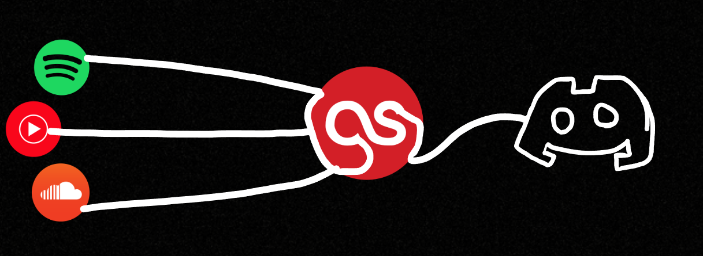
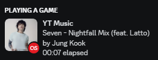

# LastFM-Discord-RPC
<br />
This adds RPC to Discord from LastFM.<br />
It will show:
* Display currently listening to music from LastFM to Discord
* Display LastFM profile picture to rich presence (Optional)
* Display scrobble amount to rich presence (Optional)

## Requirements 🛠️
1. Create a [LastFM API Key](https://www.last.fm/api/account/create)
2. Install the packaged version [here](https://github.com/chubbyyb/LastFM-Discord-RPC/releases/tag/v0.2)
3. Run ``lfmRPC.exe``
4. Press settings, input your username and API key
5. Restart the program

# Build 🛠️
I like using electronmon because it hot reloads, feel free to edit manually
1. ```bash
   npm install
   ```
2. ```bash
   npm install electronmon
   ```
3. ```
   npx electronmon .
   ```
   
 
## Images 🎵
<br />
<br />
> Using profile picture as small image<br />
<br />


<details>
<summary>💽 Supported Platforms:</summary>
<ul>
<li>Anything that scrobbles to LastFM is supported</li>
<li>This extension scrobbles most of the major streaming platforms: https://chrome.google.com/webstore/detail/web-scrobbler/hhinaapppaileiechjoiifaancjggfjm</li>
</ul>
</details>


